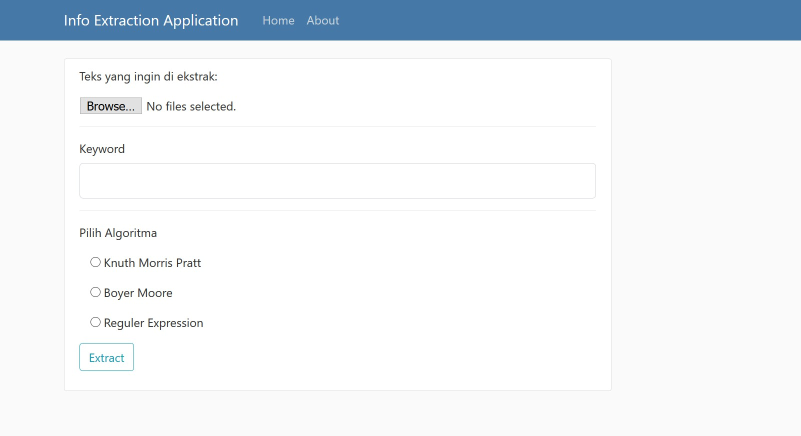
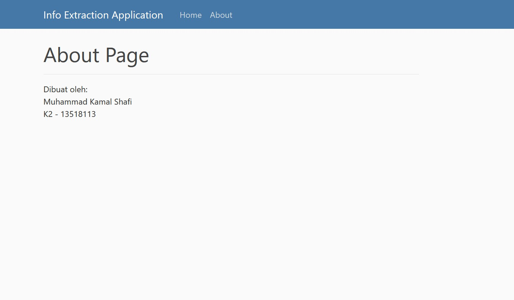

# Tugas Kecil 4 Strategi Algoritma
## InfoExtractionApp
### A simple info extraction application to get a number and date related to input keyword

link: https://simple-news-info-extraction.herokuapp.com/

Dibuat oleh: Muhammad Kamal Shafi - K02 - 13518113

# Strutur File / Kode

        ├── Tucil4StrAlgo-13518113
        │   ├── doc
        │   │   ├── Tucil4StrAlgo-13518113.pdf
        │   │   ├── . . .
        │   ├── src
        │   │   ├── static
        │   │   ├── templates
        │   │   ├── forms.py
        │   │   ├── InfoExtracting.py
        │   │   ├── PatternMatching.py
        │   │   ├── . . .
        │   ├── test
        │   │   ├── query.txt
        │   │   ├── testcase1.txt
        │   │   ├── testcase2.txt
        │   │   ├── . . .  
        │   ├── venv  
        │   ├── README.md
        │   ├── requirements.txt

# Menjalankan program
## Requirements
Python 3.7 with dependencies of

    click==7.1.1
    Flask==1.1.2
    Flask-WTF==0.14.3
    gunicorn==20.0.4
    itsdangerous==1.1.0
    Jinja2==2.11.2
    joblib==0.14.1
    MarkupSafe==1.1.1
    nltk==3.5
    regex==2020.4.4
    tqdm==4.45.0
    Werkzeug==1.0.1
    WTForms==2.2.1

## Cara *run*
### Gunakan virtual environment yang sudah terinstall dependencies
Dari folder Tucil4StrAlgo-13518113, Ketik pada terminal:

    venv\Scripts\activate.bat

### Jalankan Program
buka link: https://simple-news-info-extraction.herokuapp.com/

atau

1. Masuk ke folder src

        cd src

    lalu, ketik pada terminal:

    untuk windows

        set FLASK_APP=InfoExtractionApp.py
        flask run

    untuk linux

        export FLASK_APP=InfoExtractionApp.py
        flask run

2. Buka pada browser

        http://localhost:5000/

# *Screen Capture Program*

## Home Page

## About Page

